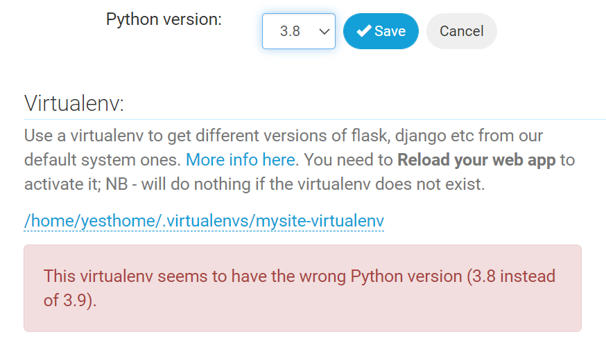

## django.memo

[DjangoのstaticディレクトリでCSSとJSを扱う](https://creepfablic.site/2019/11/20/django-static/)

# pythonanywhereでデプロイ

https://help.pythonanywhere.com/pages/DeployExistingDjangoProject/

** $ pwd
/home/yesthome

** $ git clone https://github.com/aroriq/yest.git

** $ mkvirtualenv --python=/usr/bin/python3.8 mysite-virtualenv  

** (mysite-virtualenv) $ pip install django pandas matplotlib
   (mysite-virtualenv) $ pip install django-widget-tweaks

** Create a Web app with Manual Config

Manual configuration (including virtualenvs)選択

Manual configuration involves editing your own WSGI configuration file in /var/www/. Usually this imports a WSGI-compatible application which you've stored elsewhere

When you click "Next", we will create a WSGI file for you, including a simple "Hello World" app which you can use to get started, as well as some comments on how to use other frameworks.

You will also be able to specify a virtualenv to use for your app.

** Enter your virtualenv name
/home/yesthome/.virtualenvs/mysite-virtualenv

** Optional: enter path to your code

** Edit your WSGI file

import os
import sys

# assuming your Django settings file is at '/home/myusername/mysite/mysite/settings.py'
# assuming your Django settings file is at '/home/yesthome/yest/yest/yest/settings.py'
path = '/home/yesthome/yest/yest'
if path not in sys.path:
    sys.path.insert(0, path)

os.environ['DJANGO_SETTINGS_MODULE'] = 'yest.settings'

## Uncomment the lines below depending on your Django version
###### then, for Django >=1.5:
from django.core.wsgi import get_wsgi_application
application = get_wsgi_application()

** Database setup
cd to navigate to the directory where your Django project's manage.py lives, then run

cd yest
./manage.py migrate

(mysite-virtualenv) 21:23 ~ $ pwd
/home/yesthome
(mysite-virtualenv) 21:54 ~ $ cd yest/yest
(mysite-virtualenv) 21:54 ~/yest/yest (main)$ ls
blog  boards  db.sqlite3  docs  manage.py  sales  static  templates  yest  yhauth
(mysite-virtualenv) 21:54 ~/yest/yest (main)$ python manage.py migrate
Matplotlib is building the font cache; this may take a moment.
Operations to perform:
  Apply all migrations: admin, auth, boards, contenttypes, docs, sales, sessions
Running migrations:
  No migrations to apply.

  

  ** setup static files in Django
  